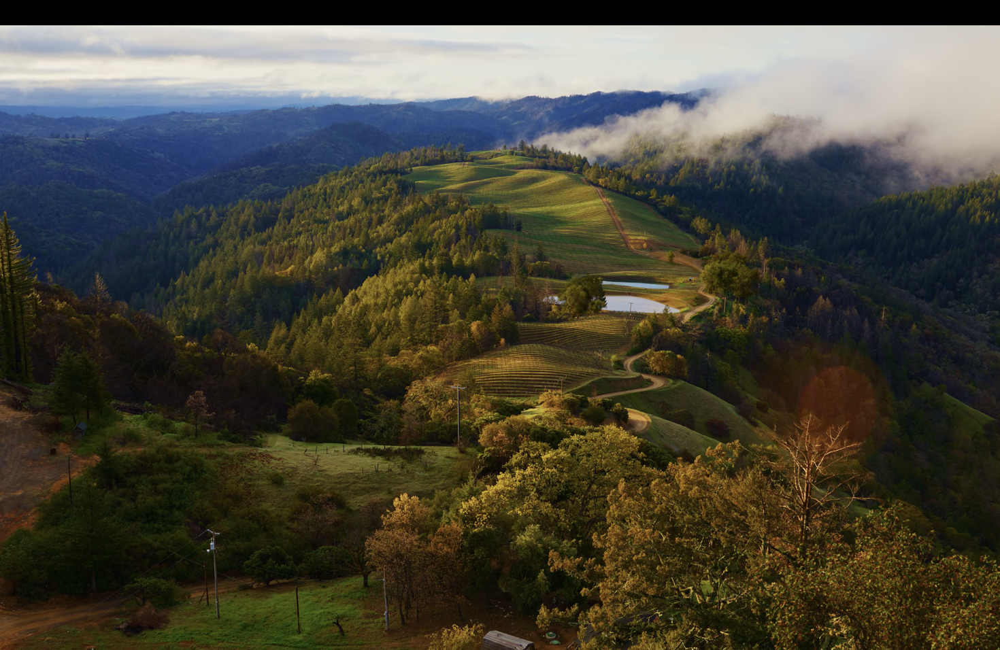
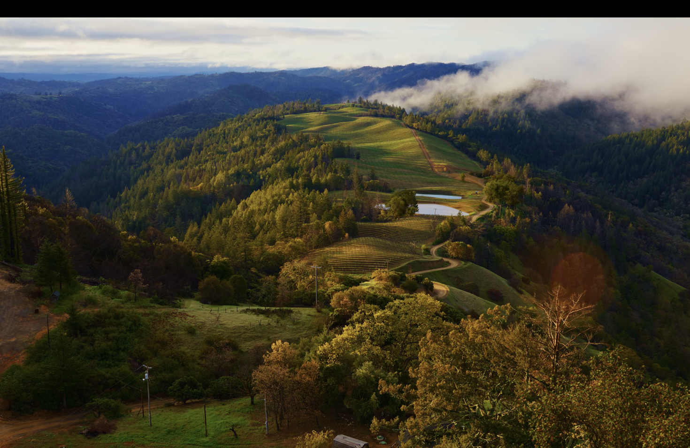
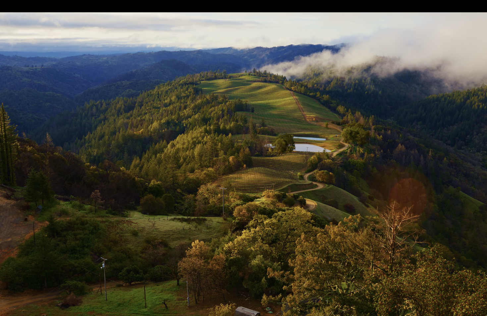

# Pendulum Physics Engine

A high-precision physics engine for N-pendulum systems (N = 1, 2, 3) with real-time browser visualization. The engine achieves energy drift below 1e-10 over 60 seconds of simulation — six orders of magnitude better than the 1e-5 design target.

## Screenshots

### Single Pendulum (N=1)



A single compound pendulum with configurable rod mass, bob mass, and bob radius. The phase-space plot shows the characteristic elliptical orbit of a conservative oscillator.

### Double Pendulum (N=2)



A chaotic double pendulum released from large angles. The motion trail shows the sensitivity to initial conditions, while the energy plot confirms drift stays below 1e-9 over the simulation window.

### Triple Pendulum (N=3)



A triple pendulum with three phase-space plots showing the fully chaotic dynamics. All three links exhibit aperiodic, space-filling trajectories.

## Features

- **N = 1, 2, 3 pendulums** — serial chain with configurable rod lengths, masses, bob radii
- **Lagrangian mechanics** — manipulator-form EOM: M(theta) theta_ddot + C(theta, theta_dot) theta_dot + G(theta) = 0
- **Adaptive integration** — Dormand-Prince 5(4) with PI step-size control (atol = rtol = 1e-10)
- **Energy conservation** — |dE/E_0| < 1e-10 over 60 seconds for chaotic double/triple pendulums
- **47 validated tests** — period vs elliptic integral, energy conservation, time-reversal symmetry, zero-gravity invariants
- **WASM powered** — C++20 core compiled to WebAssembly (~285 KB), runs at 60 FPS in the browser
- **Real-time visualization** — Canvas2D pendulum renderer with motion trails, energy drift plot, and phase-space diagrams

## Quick Start

### Run the web app

```bash
cd web
npm install
npm run dev
```

Open http://localhost:5173 in your browser. Select N (1/2/3), set initial angles, and click Play.

### Run the test suite

```bash
cmake -B build -G Ninja
cmake --build build
cd build && ctest --output-on-failure
```

All 47 tests should pass in under 4 seconds.

### Rebuild WASM (after modifying C++ code)

```bash
emcmake cmake -B build-wasm -G Ninja
cmake --build build-wasm
cp build-wasm/pendulum.{js,wasm} web/public/wasm/
```

## Architecture

```
C++ Physics Core (header-only, templated on N)
    |
    |-- Engine<N>: simulation driver
    |-- Dopri5<Dim>: generic adaptive ODE integrator
    |-- eom.hpp: M(theta), C(theta, theta_dot), G(theta) assembly + Cholesky solve
    |-- types.hpp: SystemConfig, State<N>, LinkParams
    |
    v
Emscripten WASM API (extern "C" functions)
    |
    v
TypeScript Bridge (PendulumEngine class)
    |
    v
React + Canvas2D Frontend
    |-- PendulumCanvas: rods, bobs, motion trail
    |-- EnergyPlot: E(t) - E_0 over time
    |-- PhaseSpacePlot: theta_i vs theta_dot_i
    |-- Controls: N, link params, ICs, gravity, play/pause
    |-- InfoPanel: t, E, |dE/E_0|, theta, FPS
```

## Precision

| Metric | Target | Achieved |
|--------|--------|----------|
| Energy drift \|dE/E_0\| over 60 s | < 1e-5 | ~1e-10 |
| Period accuracy vs elliptic integral (N=1) | < 1e-5 | < 1e-8 |
| Time-reversal error over 10 s round-trip | < 1e-5 | < 1e-8 |
| Zero-gravity velocity drift | < 1e-12 | < 1e-12 |

## Documentation

- **[Physics and Numerical Methods](docs/physics.md)** — Lagrangian formulation, EOM derivation, DOPRI5(4) integrator, validation strategy
- **[Programming Guide](docs/programming.md)** — code architecture, libraries, build system, WASM bindings, React frontend

## Tech Stack

| Component | Technology |
|-----------|-----------|
| Physics core | C++20, Eigen 3.4 |
| Integration | Dormand-Prince 5(4) with PI step control |
| Testing | Catch2 v3.5 |
| Build | CMake + Ninja |
| WASM | Emscripten |
| Frontend | React 18, TypeScript, Vite, Canvas2D |

## Requirements

- C++20 compiler (GCC 10+, Clang 13+, Apple Clang 14+)
- CMake 3.20+
- Node.js 18+
- Emscripten 3.0+ (for WASM builds)

Eigen and Catch2 are downloaded automatically by CMake.

## License

MIT
